# Submarine Simulation System 🛥️

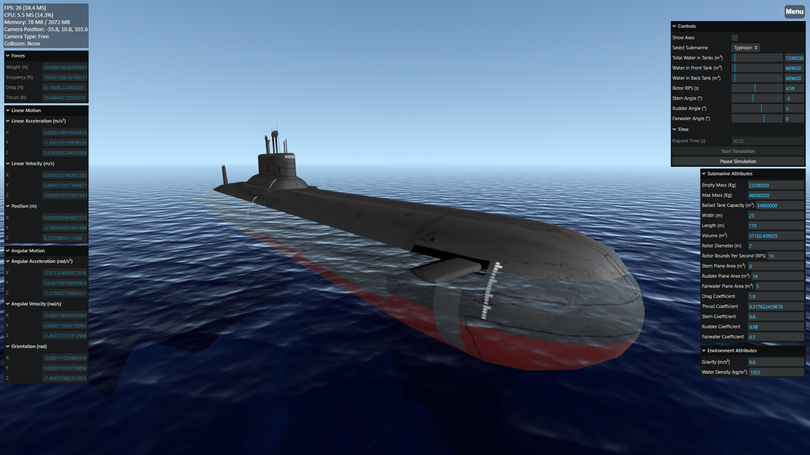

Welcome to the **Submarine Simulation System**! This project is a real-time 3D submarine simulation developed for a college project. It provides users with an immersive experience navigating various submarine models in a realistic, interactive ocean environment. This system was built with scientific precision in mind, incorporating advanced physics, hydrodynamics, and fluid mechanics to ensure accuracy. 🌊

## Features 🌟

- **Real-time Submarine Simulation**: Navigate submarines with precise controls in a beautifully rendered 3D oceanic environment. ⛴️

- **Physics-Based Simulation**: The simulation uses realistic physics, including wave interactions, buoyancy, and underwater dynamics, offering an authentic experience. 🌊

- **Multiple Submarine Models**: Choose between different submarine classes (Typhoon and Ohio), each with unique characteristics and customizable controls. 🚤

- **Comprehensive Control Panel**: Modify submarine controls like rudders, fairwater, engine speed, and ballast tanks. 🚦

- **Interactive Environment**: Experience both surface and underwater environments with accurate light refraction, shading, and sound dynamics based on the submarine’s position. 🎮

- **Responsive Camera Views**: Control the camera freely or lock it to follow the submarine, providing versatile perspectives. 🎥

- **Sound Dynamics**: Sound changes based on whether you're above or below the water surface. The engine sound adjusts based on speed and proximity. 🔊

- **Modular Design**: Built with extensibility in mind, allowing for easy customization and future feature additions. 🔧

- **Vite Build Integration**: Fast development workflow powered by Vite. ⚡

## Scientific and Technical Insights 🔬

The physics behind this simulation are based on advanced fluid dynamics and mechanical principles derived from research and a master's thesis on hydrodynamics. Here's an overview of key technical aspects:

1. **Submarine Control Physics**:

   - **Rudder**: Controls the yaw movement (left-right steering).
   - **Fairwater and Stern**: Control pitch and depth (up-down motion).
   - **Propeller Dynamics**: Speed is tied to engine RPM, affecting the submarine's forward movement.

2. **Fluid Mechanics**:

   - Simulates real-world water resistance, buoyancy, and drag forces acting on the submarine.
   - Water density and gravity are configurable parameters that impact the submarine's motion.

3. **Collision Detection**:

   - A sophisticated collision system prevents the submarine from moving through the sea floor or other objects. The system calculates corrective forces, slowing the submarine before impact.

4. **Realistic Ocean Rendering**:
   - The ocean surface and underwater environments simulate real-world lighting and refraction effects, including changing skyboxes for different times of day (dawn, noon, sunset).

## Screenshots 📸

<div style="display: flex; flex-wrap: wrap; gap: 5px; justify-content: center;">
    
    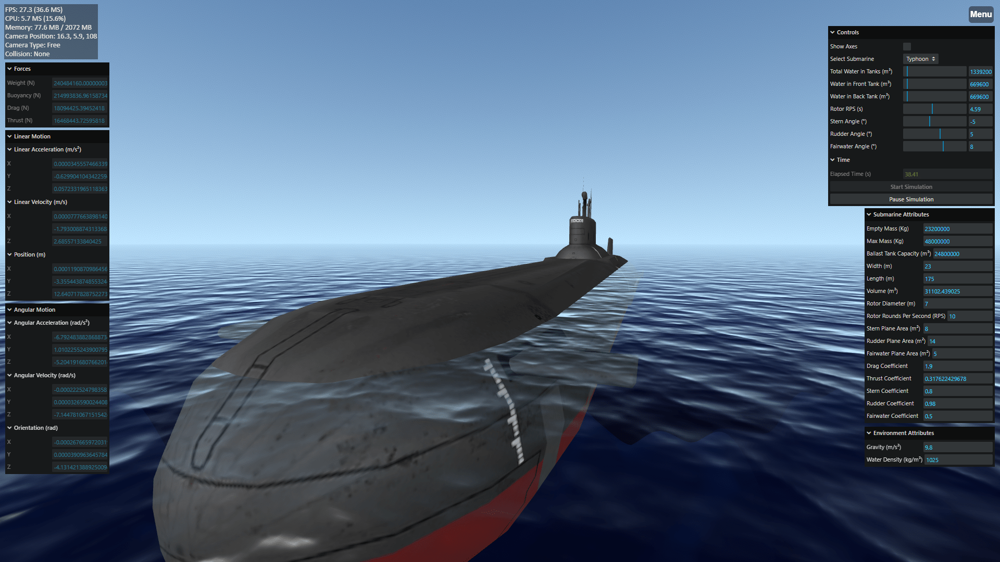
    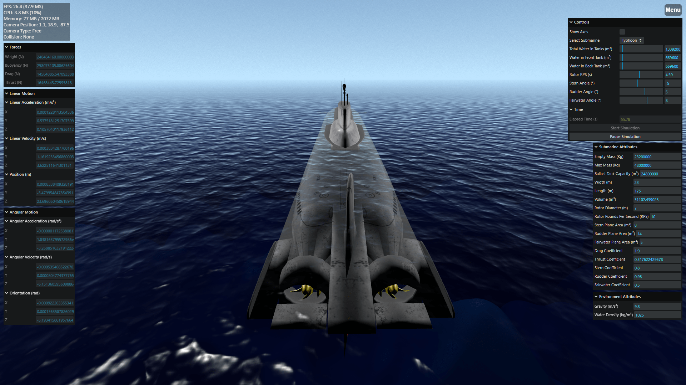
    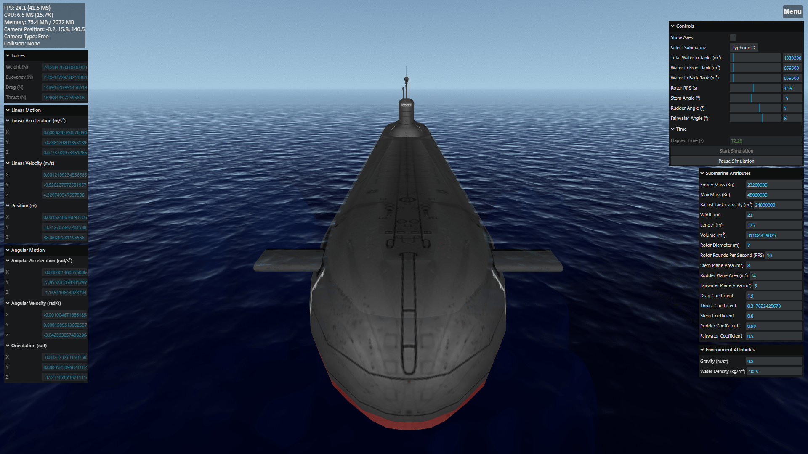
    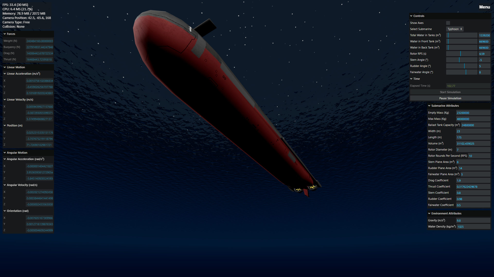
    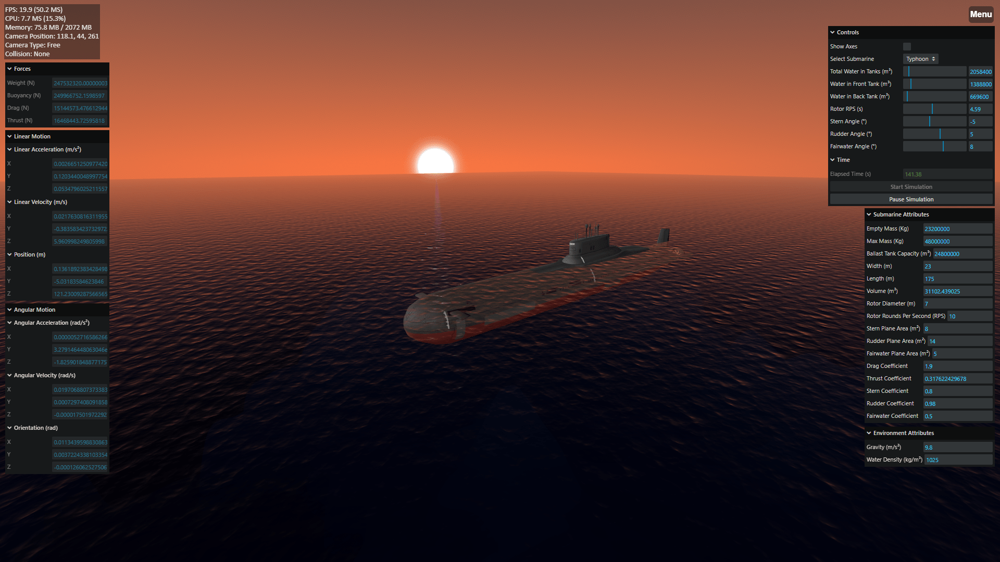
    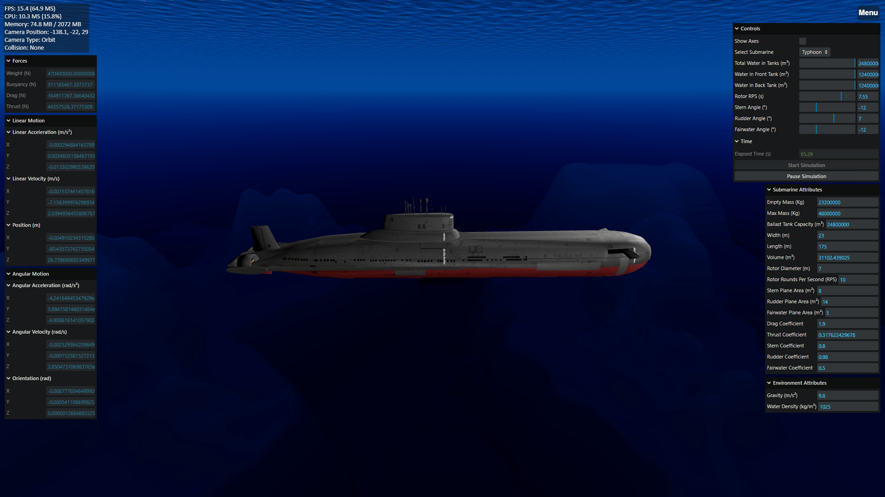
    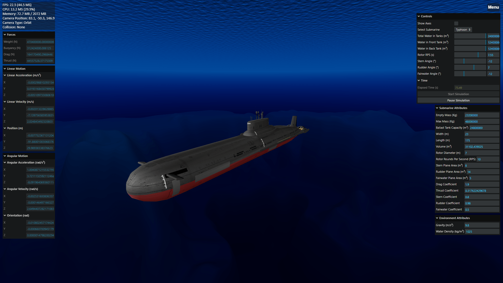
    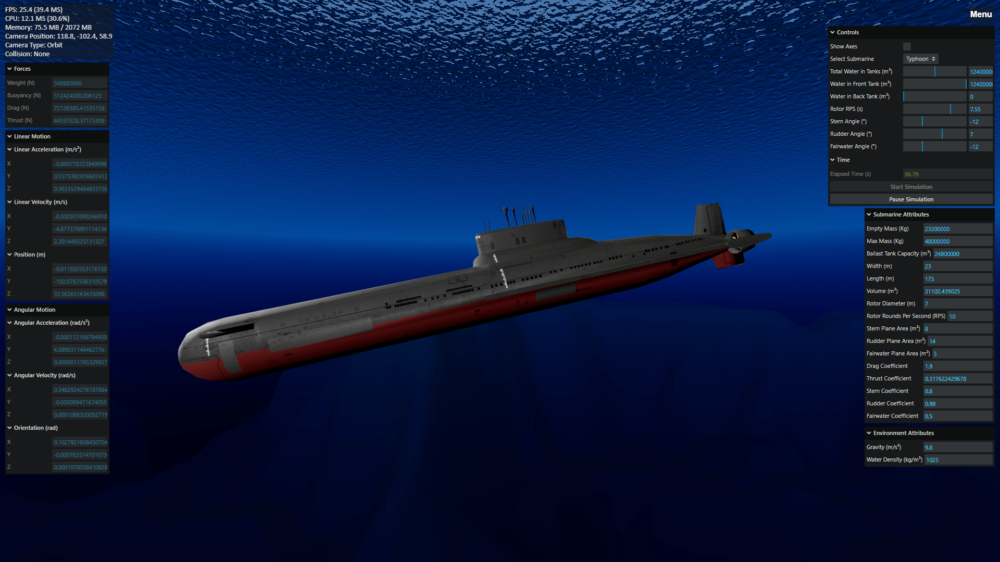
    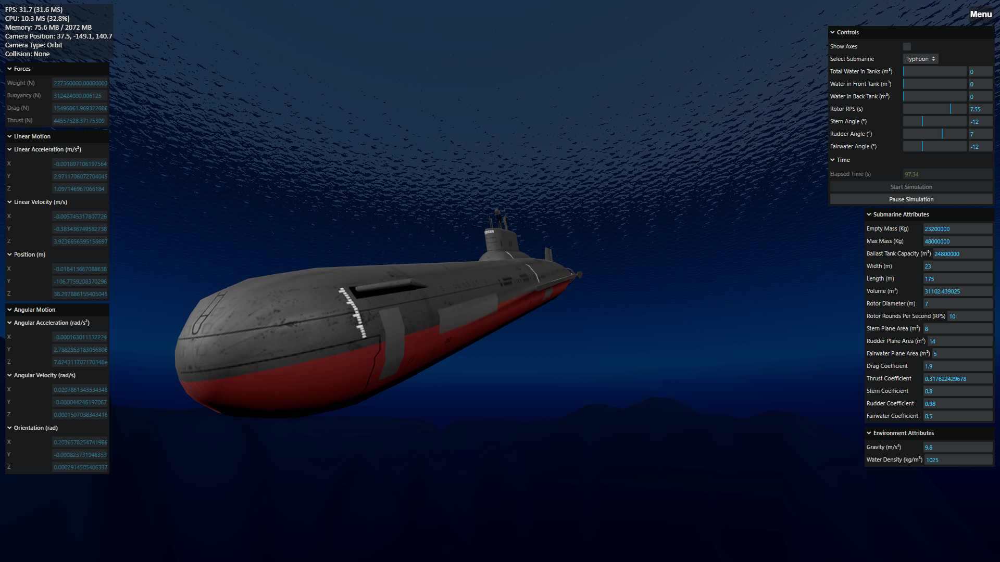
    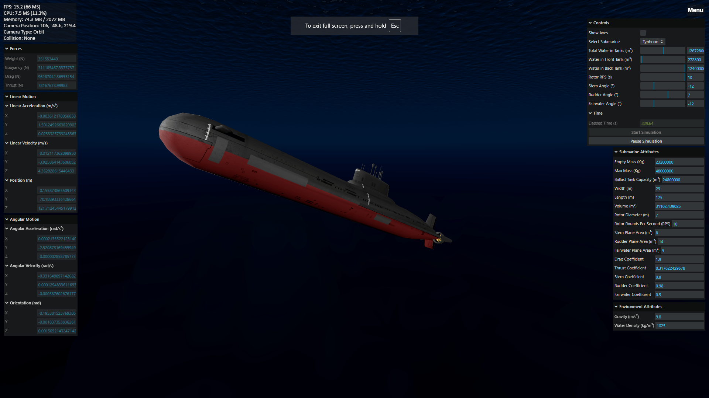
    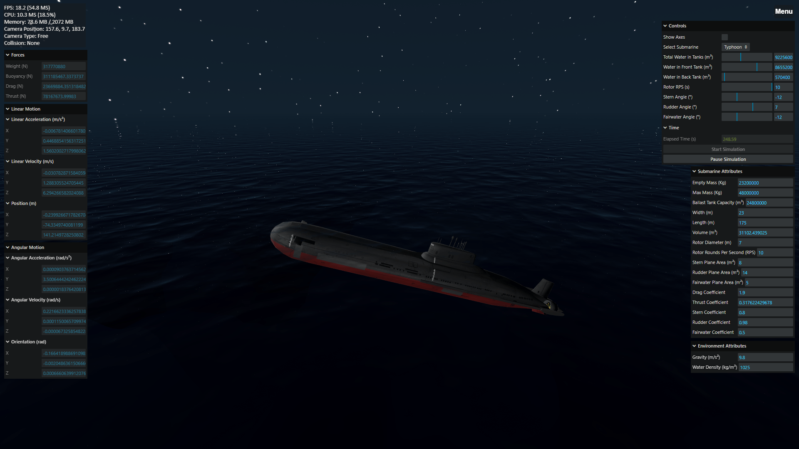
</div>

## Demo Walkthrough 🚀

The demo allows users to interact with two different submarine models and experience various controls:

1. **Models**: Navigate both the **Typhoon** and **Ohio** class submarines.
2. **Controls**:
   - Adjust **depth**, **speed**, **rudders**, and **engine power**.
   - Experience changes in submarine physics based on adjustments to ballast tanks and propeller speed.
3. **Environment Interaction**:
   - The simulation features day-night cycles, water reflection, and refraction effects.
   - Switch between surface and underwater views.
4. **Real-time Physics Display**: View detailed data on submarine dynamics in a side panel (speed, angle, depth).

For more detailed information, please refer to the project report attached in this repository.

## Technical Specifications ⚙️

- **Frontend**: Developed using **Three.js** for real-time 3D rendering. 🖼️
- **Bundler**: **Vite** provides fast and efficient build processes. ⚡
- **Docker Integration**: Supports Docker for easy containerized deployment. 🐳

## Getting Started 🛠️

### Prerequisites

- **Node.js**: Make sure Node.js is installed.
- **Docker** (Optional): Recommended for consistent environment setup.

### Installation

1. **Clone the Repository**:

   ```bash
   git clone https://github.com/your-username/submarine-simulation-system.git
   ```

2. **Navigate to the Project Directory**:

   ```bash
   cd submarine-simulation-system
   ```

3. **Install Dependencies**:

   ```bash
   npm install
   ```

4. **Run Locally**:

   ```bash
   npm run dev
   ```

   Open the application at [http://localhost:8084/](http://localhost:8084/).

### Build for Production

To create an optimized production build:

```bash
npm run build
```

### Docker Setup (Optional)

Run the project using Docker for a containerized environment:

```bash
docker build -t your-custom-image-name .
docker run -p 8084:8084 your-custom-image-name
```

## Documentation 📚

A documentation website has been created for this project, detailing the code structure and usage. Access it [here](https://submarine-simulation-system.vercel.app/docs/index.html).

## Live Demo 🌐

The project is also deployed and accessible online at [https://submarine-simulation-system.vercel.app/](https://submarine-simulation-system.vercel.app/).

## Report 📄

The full project report is available [here](https://drive.google.com/file/d/1rsalPLjlAjoH_NkcdwBgn2d28TMUr5RN/view?usp=drive_link). It includes detailed information about the physics, hydrodynamics, and technical design of the submarine simulation system.

## Integration of Open Source Work 🌍

The environment and ocean rendering in this project were adapted from the open-source [Three.js Ocean Scene](https://github.com/Nugget8/Three.js-Ocean-Scene) by Nugget8. Special thanks to the original author for providing this fantastic resource.

## Contributing 🤝

We welcome contributions! Here’s how you can contribute:

1. **Fork the repository**.
2. **Create a feature branch** (`git checkout -b feature-name`).
3. **Commit your changes** (`git commit -m 'Add new feature'`).
4. **Push to the branch** (`git push origin feature-name`).
5. **Open a pull request**.

## License 📜

This project is licensed under the **MIT License**.
